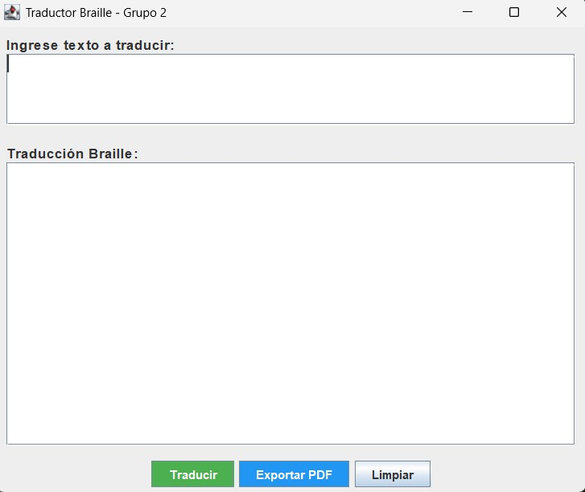
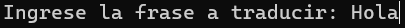
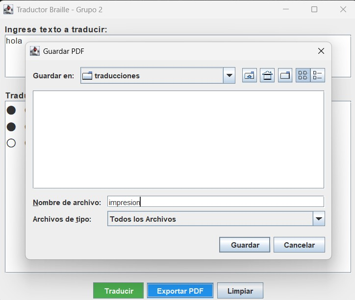
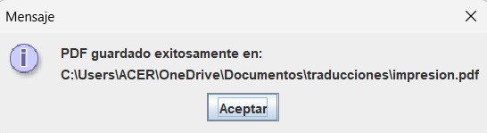
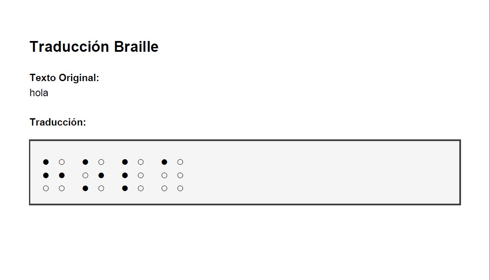

<!-- PORTADA -->
<body style="margin: 0 50px">

<div style="margin-top: 40px;">

<hr style="border: 1px solid #999;">

<p style="font-size: 33px; color:#0a2b50; font-weight: bold; text-align: right;">
Equipo 2
</p>

<hr style="border: 1px solid #999;">

<div style="height: 250px;"></div>

<p style="font-size: 40px; font-weight: bold; color:#0a2b50; text-align: right;">
Traductor Braille
</p>
<p style="font-size: 30px; font-weight: bold; color:#0a2b50; text-align: right;">
Manual de Usuario
</p>

<div style="height: 125px;"></div>

<p style="font-size: 21px; font-weight: bold; color:#0a2b50; text-align: right;">
Versión 2.0
</p>

<hr style="border: 1px solid #999;">

</div>

<div style="page-break-after: always;"></div>

<!-- TABLA DE CONTENIDOS -->
<div>
  <p style="font-size: 18px; font-weight: bold; color:#4f81bd; text-align: left;">
    Tabla de Contenidos
  </p>
  <ul style="list-style-type: none; padding-left: 0;">
    <li><a style="color: black;" href="#sec-1-introduccion">1. Introducción</a></li>
    <li><a style="color: black;" href="#sec-1-1-proposito">&emsp;1.1. Propósito del sistema</a></li>
    <li><a style="color: black;" href="#sec-1-2-audiencia">&emsp;1.2. Audiencia objetivo</a></li>
    <li><a style="color: black;" href="#sec-1-3-vision">&emsp;1.3. Visión general del sistema</a></li>
    <li><a style="color: black;" href="#sec-1-4-beneficios">&emsp;1.4. Beneficios del sistema</a></li>
    <li><a style="color: black;" href="#sec-1-5-estructura">&emsp;1.5. Estructura del manual</a></li>
    <li><a style="color: black;" href="#sec-2-requisitos">2. Requisitos Previos</a></li>
    <li><a style="color: black;" href="#sec-2-1-tecnicos">&emsp;2.1. Requisitos técnicos</a></li>
    <li><a style="color: black;" href="#sec-2-2-hardware">&emsp;2.2. Hardware requerido</a></li>
    <li><a style="color: black;" href="#sec-2-3-software">&emsp;2.3. Software requerido</a></li>
    <li><a style="color: black;" href="#sec-2-4-ejecucion">&emsp;2.4. Ejecución mediante archivo .bat</a></li>
    <li><a style="color: black;" href="#sec-3-uso">3. Uso del Sistema</a></li>
    <li><a style="color: black;" href="#sec-3-1-inicio">&emsp;3.1. Inicio del programa</a></li>
    <li><a style="color: black;" href="#sec-3-2-ingreso">&emsp;3.2. Ingreso de texto</a></li>
    <li><a style="color: black;" href="#sec-3-3-lectura">&emsp;3.3. Lectura de la traducción en Braille</a></li>
    <li><a style="color: black;" href="#sec-3-4-impresion">&emsp;3.4. Exportación de traducción a PDF</a></li>
    <li><a style="color: black;" href="#sec-4-problemas">4. Solución de Problemas Comunes</a></li>
    <li><a style="color: black;" href="#sec-4-1-consola">&emsp;4.1. La consola se cierra inmediatamente</a></li>
    <li><a style="color: black;" href="#sec-4-2-no-traduccion">&emsp;4.2. No aparece la traducción</a></li>
    <li><a style="color: black;" href="#sec-4-3-texto-cortado">&emsp;4.3. El texto aparece cortado o con espacios incorrectos</a></li>
    <li><a style="color: black;" href="#sec-4-4-no-pdf">&emsp;4.4. No se genera el PDF</a></li>
    <li><a style="color: black;" href="#sec-5-apendices">5. Apéndices</a></li>
    <li><a style="color: black;" href="#sec-5-1-glosario">&emsp;5.1. Glosario</a></li>
    <li><a style="color: black;" href="#sec-5-2-contacto">&emsp;5.2. Información de contacto</a></li>
  </ul>
</div>

<div style="page-break-after: always;"></div>

<p id="sec-1-introduccion" style="font-size: 15px; font-weight: bold; color:#4f81bd; text-align: justify;">
1. Introducción
</p>
<p id="sec-1-1-proposito" style="font-weight: bold; color:#4f81bd; text-align: justify;">
1.1. Propósito del sistema
</p>
<p style="text-align: justify;">
El sistema de traducción Braille permite convertir textos escritos en español al sistema de lectoescritura Braille de manera automática. Esta versión incorpora dos formas de uso: una interfaz gráfica intuitiva y una ejecución previa mediante consola. La nueva interfaz GUI facilita el ingreso de texto, visualización en Braille usando puntos gráficos y la exportación del resultado en formato PDF.
</p>
<p id="sec-1-2-audiencia" style="font-weight: bold; color:#4f81bd; text-align: justify;">
1.2. Audiencia objetivo
</p>
<p style="text-align: justify;">
Este manual está dirigido a cualquier persona que utilice el programa, sin necesidad de conocimientos técnicos avanzados.
</p>
<p id="sec-1-3-vision" style="font-weight: bold; color:#4f81bd; text-align: justify;">
1.3. Visión general del sistema
</p>
<p style="text-align: justify;">
El programa funciona ahora mediante una interfaz gráfica amigable en la cual el usuario puede:

1. Ingresar el texto a traducir en un cuadro de texto superior.
2. Presionar el botón <b>Traducir</b> para visualizar la conversión a Braille mediante puntos gráficos.
3. Exportar la traducción a un archivo PDF utilizando el botón <b>Exportar PDF</b>.
4. Limpiar los campos mediante el botón <b>Limpiar</b> para realizar nuevas traducciones.

La interfaz facilita la comprensión visual del Braille y estandariza la salida para impresión o almacenamiento en PDF.
</p>

<p id="sec-1-4-beneficios" style="font-weight: bold; color:#4f81bd; text-align: justify;">
1.4. Beneficios del sistema
</p>
<p style="text-align: justify;">

- Interfaz extremadamente sencilla.
- Permite visualizar de forma clara la estructura del Braille.
- Se ejecuta sin instalaciones complejas.
- Útil para aprendizaje básico y pruebas de traducción.
</p>
<p id="sec-1-5-estructura" style="font-weight: bold; color:#4f81bd; text-align: justify;">
1.5. Estructura del manual
</p>
<p style="text-align: justify;">
Este manual incluye:

- Requisitos para ejecutar el sistema
- Instrucciones de uso
- Referencia Braille simple
- Solución de problemas comunes
</p>

<p id="sec-2-requisitos" style="font-size: 15px; font-weight: bold; color:#4f81bd; text-align: justify; margin-top: 35px;">
2. Requisitos Previos
</p>
<p id="sec-2-1-tecnicos" style="font-weight: bold; color:#4f81bd; text-align: justify;">
2.1. Requisitos técnicos
</p>
<p style="text-align: justify;">
Para el correcto funcionamiento del programa:

- Sistema operativo Windows 7, 8, 10 o superior
- Java Runtime Environment (JRE) 8 o superior
- Permisos para guardar archivos PDF en el sistema
</p>
<p id="sec-2-2-hardware" style="font-weight: bold; color:#4f81bd; text-align: justify;">
2.2. Hardware requerido
</p>
<p style="text-align: justify;">

- Procesador básico (Intel Core i3 o equivalente)
- 2GB de RAM
- 50MB de espacio libre
</p>
<p id="sec-2-3-software" style="font-weight: bold; color:#4f81bd; text-align: justify;">
2.3. Software requerido
</p>
<p style="text-align: justify;">

- Windows 7, 8, 10 o superior
- Java Runtime Environment (JRE) 8 o superior
</p>
<p id="sec-2-4-ejecucion" style="font-weight: bold; color:#4f81bd; text-align: justify;">
2.4. Ejecución mediante archivo .bat
</p>
<p style="text-align: justify;">
Para iniciar el sistema:

1. Localice el archivo `ejecutar.bat`.
2. Haga doble clic sobre él.
3. Se abrirá la consola con el mensaje inicial del programa.
</p>

<p id="sec-3-uso" style="font-size: 15px; font-weight: bold; color:#4f81bd; text-align: justify; margin-top: 35px;">
3. Uso del Sistema
</p>
<p id="sec-3-1-inicio" style="font-weight: bold; color:#4f81bd; text-align: justify;">
3.1. Inicio del programa
</p>
<p style="text-align: justify;">

Al ejecutar el `.bat`, aparecerá:
</p>
<div align="center">

</div>
<p id="sec-3-2-ingreso" style="font-weight: bold; color:#4f81bd; text-align: justify;">
3.2. Ingreso de texto
</p>
<p style="text-align: justify;">
Escriba la palabra o frase que desea traducir y presione <b>Traducir</b>.<br>
Ejemplo:
</p>
<div align="center">

</div>
<p id="sec-3-3-lectura" style="font-weight: bold; color:#4f81bd; text-align: justify;">
3.3. Lectura de la traducción en Braille
</p>
<p style="text-align: justify;">
El sistema mostrará:

- El texto original
- Una representación visual del Braille en tres filas, con puntos altos y bajos, similar a:
</p>
<div align="center">

</div>
<p id="sec-3-4-impresion" style="font-weight: bold; color:#4f81bd; text-align: justify;">
3.4. Exportación de traducción a PDF
</p>
<p style="text-align: justify;">
El sistema permite guardar la traducción Braille en un archivo PDF mediante el botón <b>Exportar PDF</b>. Al presionarlo:

1. Se abre una ventana para seleccionar la ubicación de guardado.
2. El usuario ingresa el nombre del archivo.

<div align="center">

</div>

3. Se genera un PDF que incluye el texto original y su traducción en Braille mediante puntos gráficos.
4. El sistema confirma la creación del archivo.

<div align="center">

</div>

5. Se puede buscar el archivo en la ubicación especificada.

<div align="center">

</div>
</p>

<p id="sec-4-problemas" style="font-size: 15px; font-weight: bold; color:#4f81bd; text-align: justify; margin-top: 35px;">
4. Solución de Problemas Comunes
</p>
<p id="sec-4-1-consola" style="font-weight: bold; color:#4f81bd; text-align: justify;">
4.1. La interfaz gráfica no abre
</p>
<p style="text-align: justify;">
Posibles causas:

- No está instalado Java.
- El archivo `.jar` fue movido de carpeta.
- Faltan librerías gráficas.

Solución:

- Asegúrese de que todos los archivos del proyecto estén en la misma carpeta.
- Verifique que Java esté instalado:

```
java -version
```
</p>

<p id="sec-4-2-no-traduccion" style="font-weight: bold; color:#4f81bd; text-align: justify;">
4.2. No aparece la traducción
</p>
<p style="text-align: justify;">
Posible causa:

- El texto ingresado contiene caracteres no soportados.

Solución:

- Evite volver a usar los caracteres conflictivos.
</p>

<p id="sec-4-3-texto-cortado" style="font-weight: bold; color:#4f81bd; text-align: justify;">
4.3. El texto aparece cortado o con espacios incorrectos
</p>
<p style="text-align: justify;">
Posibles causas:

- La ventana está usando un tamaño pequeño.
- El Braille ASCII ocupa dos líneas (fila superior e inferior), lo que puede generar saltos visuales.

Solución:

- Maximice o agrande la ventana.
</p>

<p id="sec-4-4-no-pdf" style="font-weight: bold; color:#4f81bd; text-align: justify;">
4.4. No se genera el PDF
</p>
<p style="text-align: justify;">
Posibles causas:

- No se seleccionó una carpeta válida.
- El texto Braille no se generó antes de exportar.

Solución:

- Seleccione una carpeta adecuada.
- Presione primero el botón <b>Traducir</b> antes de exportar.
</p>

<p id="sec-5-apendices" style="font-size: 15px; font-weight: bold; color:#4f81bd; text-align: justify; margin-top: 35px;">
5. Apéndices
</p>
<p id="sec-5-1-glosario" style="font-weight: bold; color:#4f81bd; text-align: justify;">
5.1. Glosario
</p>
<p style="text-align: justify;">
<b>ASCII (American Standard Code for Information Interchange):</b> Código que representa caracteres usando números o símbolos simples.<br>
<b>BAT (.bat):</b> Archivo que ejecuta comandos automáticamente en Windows.<br>
<b>Braille:</b> Sistema de lectoescritura táctil basado en puntos en relieve.<br>
<b>CMD (Command Prompt):</b> Consola de Windows para ejecutar comandos y programas.<br>
<b>PDF (Portable Document Format):</b> Archivo que mantiene el formato del documento para impresión y almacenamiento.<br>
<b>GUI (Graphical User Interface):</b> Interfaz gráfica que permite usar el sistema mediante botones, cuadros de texto y ventanas.
</p>

<p id="sec-5-2-contacto" style="font-weight: bold; color:#4f81bd; text-align: justify;">
5.2. Información de contacto
</p>
<p style="text-align: justify;">

- <b>Christian Pisco:</b> christian.pisco@epn.edu.ec
- <b>Jonathan Pagual:</b> jonathan.pagual@epn.edu.ec
- <b>Kevin Calles:</b> kevin.calles@epn.edu.ec
- <b>Leonel Oña:</b> leonel.onacevallos@epn.edu.ec

</p>

</body>
