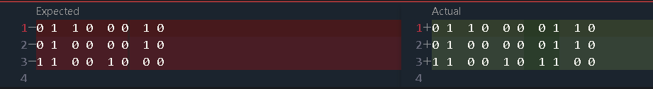
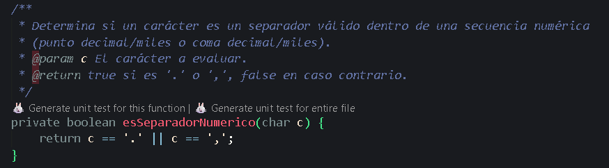
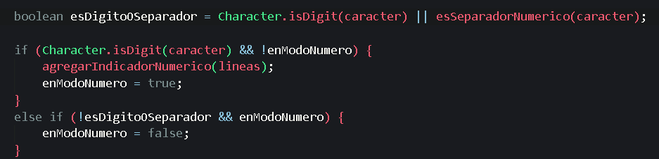

### Plan de Pruebas: `TRADUCTOR_BRAILLE_FUNCIONAL`

| **ID del Caso** | **Título del Caso de Prueba**                          | **Módulo**            | **Prioridad** |
| --------------------- | ------------------------------------------------------------- | ---------------------------- | ------------------- |
| **TC_TRAD_001** | Traducción de palabra básica en minúsculas.                | `TraductorBraille`         | Alta                |
| **TC_TRAD_002** | Manejo de espacios entre palabras.                            | `TraductorBraille`         | Alta                |
| **TC_TRAD_003** | Traducción de números usando el indicador numérico.        | `TraductorBraille`         | Crítico            |
| **TC_TRAD_004** | Traducción de mayúsculas usando el indicador de mayúscula. | `TraductorBraille`         | Crítico            |
| **TC_TRAD_005** | Manejo de caracteres acentuados ('ñ', 'á', etc.).           | `TraductorBraille`         | Media               |
| **TC_TRAD_006** | Traducción de carácter no soportado (Fallback).             | `FabricaCaracteresBraille` | Baja                |
| **TC_TRAD_007** | Traducción de números decimales.                            | `TraductorBraille`         | Alta                |
| **TC_PDF**      | Generación de PDF correcta.                                  | `GeneradorPDF`             | Alta                |

### Detalle de Casos de Prueba

### 1. Caso de Prueba: TC_TRAD_001 (Minúsculas)

**Título:** Traducción de palabra básica en minúsculas.
**Propósito:** Verificar la traducción correcta de letras minúsculas sin indicadores de modo.
**Módulo:** `TraductorBraille`

**Precondiciones:**
La `FabricaCaracteresBraille` debe estar inicializada y contener las letras 'm' e 'i'.

**Pasos de Ejecución:**

1. Llamar a `TraductorBraille.traducirTexto("mi")`.
2. Verificar la salida en formato 3x2, separada por doble espacio.

**Resultado Esperado:**
La salida debe coincidir exactamente con la representación Braille de 'm' seguido de 'i':
Fila 1: `● ●  ○ ●`
Fila 2: `○ ○  ● ○`
Fila 3: `● ○  ○ ○`

**Resultado obtenido:**

---

### 2. Caso de Prueba: TC_TRAD_002 (Manejo de Espacios)

**Título:** Manejo de espacios entre palabras.
**Propósito:** Verificar que el espacio se traduzca al Braille de espacio y que mantenga la correcta separación entre caracteres.
**Módulo:** `TraductorBraille`

**Precondiciones:**
La `FabricaCaracteresBraille` debe tener mapeado el carácter de espacio () con todos sus puntos inactivos (`[0, 0, 0, 0, 0, 0]`).

**Pasos de Ejecución:**

1. Llamar a `TraductorBraille.traducirTexto("mi sol")`.
2. Verificar que se hayan generado seis representaciones Braille.
3. Verificar que la cuarta representación Braille corresponda al espacio.

**Resultado Esperado:**
La salida debe componerse de las representaciones Braille de 'm', 'i', ' ', 's', 'o', 'l', con la separación estándar entre caracteres.

* El Braille del **Espacio** debe ser:
  Fila 1: `○ ○`
  Fila 2: `○ ○`
  Fila 3: `○ ○`
* **Composición Final (M I ' ' S O L):**
  Fila 1: `● ●  ○ ●  ○ ○  ○ ●  ● ○  ● ○`
  Fila 2: `○ ○  ● ○  ○ ○  ● ○  ○ ●  ● ○`
  Fila 3: `● ○  ○ ○  ○ ○  ● ○  ● ○  ● ○`

**Resultado obtenido:**

---

### 3. Caso de Prueba: TC_TRAD_003 (Números)

**Título:** Traducción de números usando el indicador numérico.
**Propósito:** Verificar que el modo numérico se active correctamente antes de un dígito.
**Módulo:** `TraductorBraille`

**Precondiciones:**
La fábrica debe contener el indicador numérico y los Braille de los dígitos.

**Pasos de Ejecución:**

1. Llamar a `TraductorBraille.traducirTexto("5")`.
2. Verificar que el indicador numérico se anteponga al Braille del dígito '5' (que es el mismo que 'e').

**Resultado Esperado:**
La salida debe componerse del **Indicador Numérico** (`0 1`, `0 1`, `1 1`) seguido del Braille de la letra 'e':
Fila 1: `○ ●  ● ○`
Fila 2: `○ ●  ○ ●`
Fila 3: `● ●  ○ ○`

Resultado obtenido:

---

### **4. Caso de Prueba: TC_TRAD_004 (Mayúsculas)**

**Título:** Traducción de palabra con mayúscula inicial.

**Precondiciones:** La `FabricaCaracteresBraille` debe devolver la representación minúscula para las mayúsculas (comportamiento de  *fallback* ).

**Pasos de Ejecución:**

1. Llamar a `TraductorBraille.traducirTexto("Hola")`.
2. Verificar la posición del indicador de mayúscula.

**Resultado Esperado:** La salida debe componerse de:

**Indicador de Mayúscula**

`○ ●`

`○ ○`

`○ ●`

+ Braille de 'h'
+ Seguido por los Braille de 'o', 'l', 'a'.

(El indicador solo debe aparecer  **antes de la primera letra mayúscula** ).

**Resultado Obtenido:**

---

### 5. Caso de Prueba: TC_TRAD_005 (Acentuados)

**Título:** Traducción de caracteres acentuados/especiales ('ñ').
**Propósito:** Verificar que los caracteres especiales del español mapeados se traduzcan directamente, sin indicadores de modo.
**Módulo:** `TraductorBraille`

**Precondiciones:**
El carácter 'ñ' debe estar mapeado directamente en la `FabricaCaracteresBraille`.

**Pasos de Ejecución:**

1. Llamar a `TraductorBraille.traducirTexto("ñ")`.
2. Verificar que la salida coincida con el Braille de 'ñ'.

**Resultado Esperado:**
La salida debe coincidir exactamente con el Braille de 'ñ':
Fila 1: `● ●`
Fila 2: `● ●`
Fila 3: `○ ●`

**Resultado Obtenido:**

---

### 6. Caso de Prueba: TC_TRAD_006 (No Soportados)

**Título:** Traducción de carácter no soportado (Fallback).
**Propósito:** Verificar que el sistema maneje gracia y consistentemente un carácter no mapeado, devolviendo la representación de '?' Braille.
**Módulo:** `FabricaCaracteresBraille`

**Precondiciones:**
El carácter `@` no debe estar presente en el mapa de la `FabricaCaracteresBraille`.

**Pasos de Ejecución:**

1. Llamar a `TraductorBraille.traducirTexto("A@Z")`.
2. Verificar que `@` sea traducido como el signo de interrogación, manteniendo los indicadores de mayúscula para la 'A' y 'Z'.

**Resultado Esperado:**
La traducción debe incluir: **Indicador Mayúscula** + **Braille A** + **Braille ?** + **Indicador Mayúscula** +  **Braille Z** .
La representación de `@` debe ser:
Fila 1: `○ ○`
Fila 2: `● ○`
Fila 3: `● ●`

**Resultado Obtenido:**

---

### 7. Caso de Prueba: TC_TRAD_007 (Números con Punto)

**Título:** Traducción de números decimales.
**Propósito:** Verificar que la secuencia de números, incluyendo el punto (`.`), active el modo numérico y que el punto se traduzca correctamente (como punto final, según la implementación actual).
**Módulo:** `TraductorBraille`

**Precondiciones:**

1. La fábrica debe contener el indicador numérico.
2. El carácter `.` debe estar mapeado como el Braille de punto final (`[0, 0, 1, 0, 0, 0]`).

**Pasos de Ejecución:**

1. Llamar a `TraductorBraille.traducirTexto("1.2")`.
2. Verificar que el indicador numérico se active al inicio de la secuencia.
3. Verificar que el `.` no rompa el modo numérico.

**Resultado Esperado:**
La salida debe componerse de: **Indicador Numérico** + **Braille '1'** + **Braille de punto final** +  **Braille '2'** .
Fila 1: `○ ●  ● ○  ○ ○  ● ○`
Fila 2: `○ ●  ○ ○  ○ ○  ● ○`
Fila 3: `● ●  ○ ○  ● ○  ○ ○`

**Resultado Obtenido:**

**Analisis del problema:**

Lo que sucede es que se crea el identificador de número luego de el signo "." o ","

**Solución:**

Crear una método para verificar el separador numérico.

y cambiar la lógica de la traducción:

evitando asi que se cree el identificador de número luego del "," o "."

**Resultado luego de la corrección**:

---

### 8. Caso de Prueba: TC_PDF

**Título:** Generación de PDF correcta.
**Propósito:** Confirmar que el método `crearDocumento` se ejecuta sin errores, crea un archivo PDF en el sistema de archivos y que dicho archivo no está vacío, validando la integración con la librería iTextPDF.

**Precondiciones:**

1. La librería `iTextPDF` debe estar correctamente configurada en el proyecto.
2. La ruta de salida debe ser accesible para escritura.
3. Los datos de entrada (`textoOriginal` y `textoBraille`) son cadenas de texto válidas.

**Pasos de Ejecución:**

1. Definir una ruta de salida temporal (`test_traduccion_braille.pdf`).
2. Llamar a `GeneradorPDF.crearDocumento(ruta, "Texto Original", "Braille Traducido")`.
3. Verificar que la ejecución no lance excepciones.
4. Verificar la existencia del archivo en la ruta de salida.
5. Verificar que el tamaño del archivo sea mayor a cero.

**Resultado Esperado:**

1. El método `crearDocumento` finaliza sin lanzar excepciones (`Exception`).
2. El archivo `test_traduccion_braille.pdf` existe en el disco.
3. El archivo tiene un tamaño (`length()`) mayor a 0 bytes, indicando que se escribió contenido (metadatos del PDF, texto original, y la tabla Braille).

**Resultado obtenido:**

